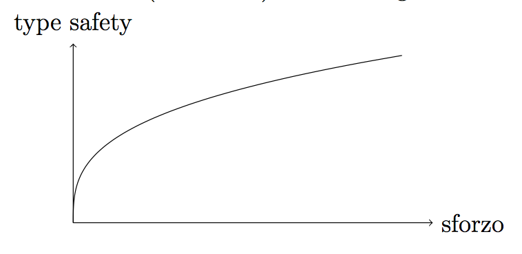

<!-- START doctoc generated TOC please keep comment here to allow auto update -->
<!-- DON'T EDIT THIS SECTION, INSTEAD RE-RUN doctoc TO UPDATE -->

- [Introduzione](#introduzione)
  - [Setup](#setup)
  - [Come eseguire gli esercizi del corso](#come-eseguire-gli-esercizi-del-corso)
    - [`$ExpectType` e `$ExpectError`](#expecttype-e-expecterror)
  - [Il type system di TypeScript è strutturale](#il-type-system-di-typescript-%C3%A8-strutturale)
  - [Funzioni parziali](#funzioni-parziali)
  - [Strutture dati mutabili](#strutture-dati-mutabili)
  - [Il tipo `object`](#il-tipo-object)
  - [I tipi `any`, `never` e `unknown`](#i-tipi-any-never-e-unknown)
- [Tour delle feature avanzate](#tour-delle-feature-avanzate)
  - [Inline declarations](#inline-declarations)
  - [Polimorfismo](#polimorfismo)
  - [Overloadings](#overloadings)
  - [Raffinamenti con le custom type guards](#raffinamenti-con-le-custom-type-guards)
  - [Lifting di un valore: l'operatore `typeof`](#lifting-di-un-valore-loperatore-typeof)
  - [Immutabilità: il modificatore `readonly`](#immutabilit%C3%A0-il-modificatore-readonly)
  - [Index types](#index-types)
    - [Index type query operator: `keyof`](#index-type-query-operator-keyof)
    - [Indexed access operator: `[]`](#indexed-access-operator-)
  - [Mapped types](#mapped-types)
  - [Subtyping e type parameter](#subtyping-e-type-parameter)
  - [Module augmentation](#module-augmentation)
  - [Conditional types](#conditional-types)
  - [Mapped tuples](#mapped-tuples)
  - [`as const`](#as-const)
- [Definition file](#definition-file)
  - [Un problema serio: le API JavaScript](#un-problema-serio-le-api-javascript)
- [ADT (Algebraic Data Types)](#adt-algebraic-data-types)
  - [Che cos'è un ADT?](#che-cos%C3%A8-un-adt)
  - [Product types](#product-types)
    - [Perchè "product" types?](#perch%C3%A8-product-types)
    - [Quando posso usare un product type?](#quando-posso-usare-un-product-type)
  - [Sum types](#sum-types)
    - [Costruttori](#costruttori)
    - [Pattern matching](#pattern-matching)
    - [Perchè "sum" types?](#perch%C3%A8-sum-types)
    - [Quando dovrei usare un sum type?](#quando-dovrei-usare-un-sum-type)
  - [Functional error handling](#functional-error-handling)
    - [Il tipo `Option`](#il-tipo-option)
    - [Il tipo `Either`](#il-tipo-either)
- [TDD (Type Driven Development)](#tdd-type-driven-development)
- [Finite state machines](#finite-state-machines)
- [Come migliorare la type inference delle funzioni polimorfiche](#come-migliorare-la-type-inference-delle-funzioni-polimorfiche)
- [Simulazione dei tipi nominali](#simulazione-dei-tipi-nominali)
- [Refinements e smart constructors](#refinements-e-smart-constructors)
- [Phantom types](#phantom-types)
- [Newtypes](#newtypes)
- [Validazione a runtime](#validazione-a-runtime)
- [Covarianza e controvarianza](#covarianza-e-controvarianza)
- [Parse, don't validate](#parse-dont-validate)
- [Idea: building a type safe DSL for filter](#idea-building-a-type-safe-dsl-for-filter)

<!-- END doctoc generated TOC please keep comment here to allow auto update -->

# Introduzione

Questo corso mira ad esporre una serie di tecniche per sfruttare al massimo la _type safety_ che offre il linguaggio TypeScript.

> Type safe usually refers to languages that ensure that an operation is working on the right kind of data at some point
> before the operation is actually performed. This may be at compile time or at runtime.

**Obbiettivo**. (ambizioso) eliminare gli errori a runtime.



## Setup

```sh
npm i -g typescript@latest
git clone https://github.com/gcanti/typescript-course.git
cd typescript-course
npm install
```

## Come eseguire gli esercizi del corso

```sh
npx eslint test/<filename>.ts
```

**Osservazione**. Le soluzioni fornite nel repository `typescript-course` costituiscono solo un punto di referimento, **in generale gli esercizi possono ammettere piu` di una soluzione possibile**.

### `$ExpectType` e `$ExpectError`

```ts
// chapters/introduction/expect.ts

// API to test
declare function sum(a: number, b: number): number

// $ExpectError
sum(1, 'a')

// $ExpectType number
sum(1, 2)
```

## Il type system di TypeScript è strutturale

> TypeScript is a structural type system. When we compare two different types, regardless of where they came from, if the types of all members are compatible, then we say the types themselves are compatible. - Documentazione ufficiale

**Esempio**. Due classi sono compatibili se sono compatibili i loro campi

```ts
// chapters/introduction/structural.ts

export class A {}

class B {}

class C {
  constructor(public value: number) {}
}

declare function f(a: A): void

f(new A())
f(new B())
f(new C(1))
f({})
f(f)

declare function g(c: C): void

g(new C(1))
// $ExpectError
g(new A())
```

## Funzioni parziali

Una grande fonte di problemi e bug sono le funzioni parziali, specialmente in TypeScript, vediamone la definizione:

**Definizione**. Una funzione _parziale_ `f: X ⟶ Y` è una funzione che non è definita per tutti i valori del suo dominio `X` (`Y` è chiamato il _codominio_).

Viceversa una funzione definita per tutti i valori del dominio è detta _totale_.

**Esempio**. La funzione `head`

```ts
// chapters/introduction/head.ts

function head(xs: Array<number>): number {
  return xs[0]
}

export const result: number = head([]) // no error
```

**Esempio**. La funzione `readFileSync`

```ts
// chapters/introduction/readFileSync.ts

import * as fs from 'fs'

export const result: string = fs.readFileSync('', 'utf8')
// throws "no such file or directory"
```

**Osservazione**. Il problema maggiore nel lanciare eccezioni all'interno del body di una funzione è che questo fatto non si riflette nella sua firma, quindi il comportamento della funzione **non è codificato a livello del type system** di TypeScript.

Una funzione parziale `f : X ⟶ Y` può essere sempre ricondotta ad una funzione totale `f'` aggiungendo un valore speciale (chiamiamolo `None`) _non appartenente al codominio_ e associandolo ad ogni valore di `X` per cui `f` non é definita

```
f': X ⟶ Y ∪ None
```

Chiamiamo `Option(Y) = Y ∪ None`

```
f': X ⟶ Option(Y)
```

Torneremo a parlare del tipo `Option` più avanti.

**Suggerimento**. Cercate di definire sempre funzioni totali.

## Strutture dati mutabili

In TypeScript usare strutture dati **mutabili** può condurre ad errori a runtime

```ts
// chapters/introduction/mutable.ts

const xs: Array<string> = ['foo', 'bar']
const ys: Array<string | undefined> = xs

ys.push(undefined)

export const result = xs.map(s => s.trim())
// runtime error:
// Cannot read property ’trim’ of undefined
```

**Suggerimento**. Cercate di usare strutture dati immutabili.

## Il tipo `object`

Il tipo `object` rappresenta tutti i valori meno quelli primitivi (compresi `null` e `undefined`)

```ts
// chapters/introduction/object.ts

export const x1: object = { foo: 'bar' }

export const x2: object = [1, 2, 3]

// $ExpectError
export const x3: object = 1

// $ExpectError
export const x4: object = 'foo'

// $ExpectError
export const x5: object = true

// $ExpectError
export const x6: object = null

// $ExpectError
export const x7: object = undefined
```

## I tipi `any`, `never` e `unknown`

Se pensiamo ai tipi come insiemi, allora gli _abitanti_ di un tipo sono gli elementi di quell'insieme.

```ts
// chapters/introduction/inhabitants.ts

// gli abitanti sono tutte le stringhe
export type A = string

// gli abitanti sono tutti i numeri
export type B = number

// questo `e un "literal type" e contiene un solo abitante:
// la stringa "foo"
export type C = 'foo'
```

**Esercizio**: Quanti abitanti ha questo tipo?

```ts
export type D = 0 | 1
```

**Definizione**. Un tipo `A` si dice _sottotipo_ di un tipo `B` se ogni abitante di `A` è abitante di `B`. Si dice _supertipo_ se vale la proprietà inversa.

**Esempio**. Il tipo `C` è sottotipo del tipo `string`. Il tipo `number` è supertipo del tipo `D`.

**Esercizio**. In che relazione sono i seguenti tipi?

```ts
type T1 = { a: string }
type T2 = { b: number; a: string }
```

- `T1` è sottotipo di `T2`?
- `T2` è sottotipo di `T1`?
- nessuno dei due

```ts
type T3 = { a: string; b: boolean }
type T4 = { b: number; a: string }
```

- `T3` è sottotipo di `T4`?
- `T4` è sottotipo di `T3`?
- nessuno dei due

**Definizione**. Un tipo `B` si dice _bottom type_ se è sottotipo di ogni altro tipo.

Il tipo `never` di TypeScript non contiene abitanti ed è un bottom type.

```ts
// chapters/introduction/bottom.ts

export function raise(message: string): never {
  throw new Error(message)
}

export function absurd<A>(_x: never): A {
  return raise('absurd')
}
```

**Definizione**. Un tipo `T` si dice top type\_ se è supertipo di ogni altro tipo.

Il tipo `any` é sia top type sia bottom type. Viene usato per "disabilitare"
il type-checker (a volte risulta necessario). Usatelo con parsimonia.

Un problema di `any` é che non é adatto a rappresentare **input non validati**.

**Esempio**. `JSON.parse` è unsafe dato che il tipo di ritorno è `any`.

```ts
const payload = `{"a":1}`
const x = JSON.parse(payload)
// `x` è di tipo `any`
x.bar.trim() // runtime error: Cannot read property 'trim' of undefined
```

Fortunatamente esiste una possibile soluzione: utilizzare il tipo `unknown`.

Il tipo `unknown` è un top type ma **non è un bottom type**.

Per poter utilizzare un valore di tipo `unknown` occorre _raffinarlo_

**Esempio**. Un `JSON.parse` type safe (o quasi, può lanciare eccezioni)

```ts
// chapters/introduction/parse.ts

export const parse: (input: string) => unknown = JSON.parse

const payload = `{"bar":"foo"}`

const x = parse(payload)

x.bar // static error: Object is of type 'unknown'
```

**Osservazione**. Come potete vedere dall'esempio ridefinire il tipo di una funzione può essere fatto in modo che non ci sia alcun costo a runtime.

Raffinare un valore vuol dire scrivere del codice specifico che permette di provare al type checker
alcune caratteristiche sul tipo del valore

```ts
if (typeof x === 'object') {
  // x ha tipo object | null
  if (x !== null) {
    // x ha tipo object
    const bar = (x as { [key: string]: unknown }).bar
    if (typeof bar === 'string') {
      // bar ha tipo string
      console.log(bar.trim())
    }
  }
}
```

Vedremo piu` avanti come sia possibile eliminare il boilerplate utilizzando le _custom type guard_.

# Tour delle feature avanzate

## Inline declarations

Un _definition file_ contiene solo dichiarazioni di tipi e servono a descrivere le API pubbliche di una package.
I definition file costituiscono un ponte tra il mondo untyped di JavaScript e quello types di TypeScript.
Tipicamente il nome di un definition file termina con `.d.ts`.

Le dichiarazione all'interno del codice invece che nei definition file sono particolarmente utili quando si stia esplorando
una soluzione e per fare velocemente delle prove di type checking.

**Esempio**. Costanti, variabili, funzioni e classi

```ts
// chapters/advanced/inline-declarations.ts

// costanti
export declare const a: number

// variabili
export declare let b: number

// funzioni
export declare function f(x: string): number
export declare const g: (x: string) => number

// classi
export declare class Foo {
  public value: string
  constructor(value: string)
}
```

In molti degli esercizi sfrutteremo questa feature lavorando solo sulle dichiarazioni invece di preoccuparci dell'implementazione.

## Polimorfismo

> Parametric polymorphism refers to when the type of a value contains one or more (unconstrained) type variables,
> so that the value may adopt any type that results from substituting those variables with concrete types.

Una funzione viene detta _polimorfica_ se può gestire diversi tipi parametrizzati da uno o più _type parameter_,
_monomorfica_ altrimenti.

```ts
// una funzione monomorfica
declare function fst(tuple: [number, number]): number

// una funzione polimorfica
declare function fst<A>(tuple: [A, A]): A
```

Le funzioni polimorfiche favoriscono una implementazione corretta:

```ts
// compila
function fst(xs: tuple: [number, number]): number {
  return 1
}

// non compila
function fst<A>(tuple: [A, A]): A {
  return 1
}
```

Esempio notevole è la funzione identità che ammette una sola implementazione possibile

```ts
function identity<A>(a: A): A {
  return a
}
```

**Suggerimento**. Quando possibile, cercate di definire funzioni polimorfiche.

**Esercizio**. Date le firme delle seguenti funzioni, cosa possiamo dire del loro comportamento?

```ts
declare function f(xs: Array<number>): Array<number>
declare function g<A>(xs: Array<A>): Array<A>
```

## Overloadings

Gli overloading servono a rendere più precise le firme delle funzioni.

Vediamo un esempio pratico.

- la funzione `f` deve restituire un numero se l'input è una stringa
- la funzione `f` deve restituire una stringa se l'input è un numero

Usare un'unione non è soddisfacente

```ts
declare function f(x: string | number): number | string

// x1: string | number
const x1 = f('foo')
// x2: string | number
const x2 = f(1)
```

Definendo due overloading possiamo rendere preciso il tipo della funzione

```ts
// chapters/advanced/overloadings.ts

declare function f(x: number): string
declare function f(x: string): number
declare function f(x: string | number): number | string

// x3: number
const x3 = f('foo')
// x4: string
const x4 = f(1)
```

La terza firma di `f` serve solo a guidare l'implementazione e **non comparirà tra quelle disponibili** in fase di utilizzo della funzione.

Gli overloading possono essere definiti anche per i metodi di una classe

```ts
class G {
  mymethod(x: number): string
  mymethod(x: string): number
  mymethod(x: string | number): number | string {
    ...
  }
}
```

**Esercizio**. Tipizzare la funzione `pipe` (composizione di funzioni).

[./test/advanced/overloadings/pipe.ts](./test/advanced/overloadings/pipe.ts)

## Raffinamenti con le custom type guards

Le custom type guard servono a _raffinare_ i tipi. Un raffinemento di un tipo `A` è un tipo `B` tale che per ogni abitante `b` di `B` è anche un abitante di `A`. Un altro modo per esprimere questa condizione è dire che ogni elemento di `B` soddisfa un _predicato_ su `A`.

**Definizione**. Un _predicato_ (sul tipo `A`) è una funzione con la seguente firma:

```ts
type Predicate<A> = (a: A) => boolean
```

**Esempio**. In TypeScript la sintassi per definire un predicato non è sufficiente per raffinare un tipo

```ts
// chapters/advanced/refinements-I.ts

export function isString(x: unknown): boolean {
  return typeof x === 'string'
}

export function f(x: string | number): number {
  if (isString(x)) {
    // qui x non è raffinato
    return x.length // error
  } else {
    return x // error
  }
}
```

Invece viene utilizzata questa sintassi (che definisce una _custom type guard_):

```ts
type Refinement<A, B extends A> = (a: A) => a is B
```

**Osservazione**. Notate che `B` _deve essere assegnabile_ ad `A`.
O, in altre parole, `B` deve essere un sottotipo di `A`.

> La keyword `extends` può essere usata per _mettere in relazione_ due type parameter

In particolare `extends` viene spesso usata per definire dei vincoli su di un type parameter
che siano basati su un altro type parameter (come nel tipo `Refinement`).

**Esempio**.

```ts
// chapters/advanced/refinements-II.ts

export function isString(x: unknown): x is string {
  return typeof x === 'string'
}

export function f(x: string | number): number {
  if (isString(x)) {
    // qui x è di tipo string
    return x.length
  } else {
    // qui x è di tipo number
    return x
  }
}
```

**Esempio**. Riprendiamo l'esempio del capitolo precedentemente

```ts
// chapters/advanced/refinements-III.ts

export const parse: (input: string) => unknown = JSON.parse

const payload = `{"bar":"foo"}`

const x = parse(payload)

/*
if (typeof x === 'object') {
  // x ha tipo object | null
  if (x !== null) {
    // x ha tipo object
    const bar = (x as { [key: string]: unknown }).bar
    if (typeof bar === 'string') {
      // bar ha tipo string
      console.log(bar.trim())
    }
  }
}
*/

function isString(u: unknown): u is string {
  return typeof u === 'string'
}

function isUnknownRecord(u: unknown): u is { [key: string]: unknown } {
  return Object.prototype.toString.call(u) === '[object Object]'
}

if (isUnknownRecord(x)) {
  // qui x è di tipo { [key: string]: unknown }
  if (isString(x.bar)) {
    // qui x.bar è di tipo string
    console.log(x.bar.trim())
  }
}
```

**Esempio**. Alcune custom type guard sono predefinite, un esempio notevole è `Array.isArray`

```ts
const payload = '{"bar":[1,2,3]}'
const x = parse(payload)

if (Array.isArray(x)) {
  // x ha tipo Array<any>
  console.log(x.keys)
}
```

Notate però che `Array.isArray` raffina a `Array<any>`.

**Esercizio**. Definire **e implementare** una versione di `Array.isArray` migliore [./test/advanced/custom-type-guards/isArray.ts](./test/advanced/custom-type-guards/isArray.ts).

**Esercizio**. Definire **e implementare** una custom type guard che raffina un tipo `unknown` in un `Array<number>` [./test/advanced/custom-type-guards/isArrayOfNumbers.ts](./test/advanced/custom-type-guards/isArrayOfNumbers.ts).

**Esercizio**. È possibile generalizzare la soluzione precedente? [./test/advanced/custom-type-guards/isArrayOf.ts](./test/advanced/custom-type-guards/isArrayOf.ts)

## Lifting di un valore: l'operatore `typeof`

I valori e i tipi vivono in mondi separati, però è possibile passare dal mondo dei valori a quello dei tipi
sfruttando l'operatore `typeof`.

**Osservazione**. Attenzione, in questo caso non stiamo parlando dell'omonimo operatore `typeof` di JavaScript, che lavora value-level, ma dell'operatore `typeof` di TypeScript, che lavora type-level.

**Esempio**. Ricavare il tipo di un oggetto

```ts
// chapters/advanced/typeof.ts

export const x = {
  foo: 'foo',
  baz: 1
}

// value-level ---v
export const X = typeof x
// "object"

// type-level ----v
export type X = typeof x
/*
type X = {
  foo: string;
  baz: number;
}
*/
```

## Immutabilità: il modificatore `readonly`

Il modificatore `readonly` e il tipo predefinito `Readonly` aggiungono supporto per le strutture dati immutabili a TypeScript:

```ts
// chapters/advanced/immutability.ts

//
// structs
//

export interface Person {
  readonly name: string
  readonly age: number
}

declare const person: Person

person.age = 42 // Cannot assign to 'age' because it is a read-only property

//
// records
//

interface ImmutableRecord {
  readonly [key: string]: number
}

declare const r: ImmutableRecord

r['foo'] = 1 // Index signature in type 'ImmutableRecord' only permits reading

//
// Per rendere immutabile un tipo già definito è possibile usare il tipo predefinito `Readonly`.
// Per la sua implementazione si veda la sezione Mapped types
//

export interface Point {
  x: number
  y: number
}

export type ImmutablePoint = Readonly<Point>
/*
type ImmutablePoint = {
    readonly x: number;
    readonly y: number;
}
*/

declare const p: ImmutablePoint

p.x = 1 // Cannot assign to 'x' because it is a read-only property

//
// classes
//

export class Point2D {
  constructor(readonly x: number, readonly y: number) {}
}

declare const p2: Point2D

p2.x = 1 // Cannot assign to 'x' because it is a read-only property

//
// tuples
//
export type ImmutableTuple = readonly [string, number]

declare const t: ImmutableTuple

t[1] = 1 // Cannot assign to '1' because it is a read-only property

//
// arrays
//

const x: ReadonlyArray<number> = [1, 2, 3]
x.push(4) // Property 'push' does not exist on type 'readonly number[]'
```

Oltre a `ReadonlyArray` ci sono interfacce analoghe per `Map` e `Set`, rispettivamente `ReadonlyMap` e `ReadonlySet`.

**Esercizio**. Rendere immutabile la seguente interfaccia

```ts
interface Person {
  name: {
    first: string
    last: string
  }
  interests: Array<string>
}
```

[./test/advanced/immutability/interface.ts](./test/advanced/immutability/interface.ts)

## Index types

### Index type query operator: `keyof`

Così come è possibile, dato un oggetto, ricavare **il valore** delle chiavi tramite la funzione `Object.keys`

```ts
const point = { x: 1, y: 2 }
const pointKeys = Object.keys(point)
// [ "x", "y" ]
```

così è possibile ricavare **il tipo** delle chiavi di un oggetto (come unione) usando l'operatore `keyof`

```ts
interface Point {
  x: number
  y: number
}

type PointKeys = keyof Point
/*
type PointKeys = "x" | "y"
*/
```

`keyof` può operare anche sugli array

```ts
type ArrayKeys = keyof Array<number>
/*
type ArrayKeys = number | "length" | "toString" |
"toLocaleString" | "push" | "pop" | "concat" | "join" |
"reverse" | "shift" | "slice" | "sort" | "splice" |
"unshift" | "indexOf" | "lastIndexOf" | "every" | "some" |
"forEach" | "map" | "filter" | "reduce" | "reduceRight" |
"entries" | "keys" | "values" | "find" | "findIndex" |
"fill" | "copyWithin"
*/
```

e le tuple

```ts
type TupleKeys = keyof [string, number]
/*
type TupleKeys = number | "0" | "1" | "length" | "toString" |
"toLocaleString" | "push" | "pop" | "concat" | "join" |
"reverse" | "shift" | "slice" | "sort" | "splice" |
"unshift" | "indexOf" | "lastIndexOf" | "every" |
"some" | "forEach" | "map" | "filter" | "reduce" |
"reduceRight" | "entries" | "keys" | "values" |
"find" | "findIndex" | "fill" | "copyWithin"
*/
```

**Esercizio**. Rendere type safe la seguente funzione `translate`

```ts
export const translations = {
  when: 'Quando',
  where: 'Dove'
}

export declare function translate(key: string): string
```

[./test/advanced/typeof/translate.ts](./test/advanced/typeof/translate.ts)

### Indexed access operator: `[]`

Così come è possibile, dato un oggetto, ricavare il valore di una sua proprietà usando l'accesso per indice

```ts
const person = { name: 'Giulio', age: 44 }
const name = person['name']
```

così l'operatore `T[K]` permette di estrarre il tipo del campo `K` dal tipo `T`

```ts
interface Person {
  name: string
  age: number
}

type Name = Person['name']
/*
type Name = string
*/

type Age = Person['age']
/*
type Age = number
*/

Person['foo'] // error
```

**Esercizio**. Ricavare il tipo del campo `baz` della seguente interfaccia

```ts
export interface Foo {
  foo: {
    bar: {
      baz: number
      quux: string
    }
  }
}
```

[./test/advanced/indexed-access-operator/Foo.ts](./test/advanced/indexed-access-operator/Foo.ts)

**Esercizio**. Ricavare il tipo delle chiavi del campo `bar` dell'interfaccia `Foo` definita nel precedente esercizio.

[./test/advanced/indexed-access-operator/bar.ts](./test/advanced/indexed-access-operator/bar.ts)

**Esercizio**. Tipizzare la seguente funzione `get` in modo che gli argomenti e il tipo di ritorno siano i più precisi possibile

```ts
declare function get(key: string, obj: unknown): unknown
```

[./test/advanced/indexed-access-operator/get.ts](./test/advanced/indexed-access-operator/get.ts)

**Esercizio**. Estrarre il tipo della prima e della seconda componente della seguente tupla

```ts
export type Tuple = [number, string, boolean]
```

[./test/advanced/indexed-access-operator/tuple.ts](./test/advanced/indexed-access-operator/tuple.ts)

**Osservazione**. Come è possibile estrarre l'**unione** dei tipi di una tupla? Accedendo con l'indice generico `number`

```ts
export type X = [string, number]

export type ValuesOfX = X[number]
```

**Esercizio**. Tipizzare la seguente funzione `set` in modo che gli argomenti e il tipo di ritorno siano i più precisi possibile

```ts
export declare function set(k: string, v: unknown, o: unknown): unknown
```

[./test/advanced/indexed-access-operator/set.ts](./test/advanced/indexed-access-operator/set.ts)

**Osservazione**. Si noti che `Object.keys` è tipizzato così

```ts
Object.keys: (o: {}) => string[]
```

**Esercizio**. Perchè? E' possibile rendere il tipo più preciso?

## Mapped types

TypeScript fornisce un modo per creare nuovi tipi basati su tipi già definiti, i _mapped types_.

La formula generale di un mapped type è la seguente

```
{ [K in U] : f(K) }
```

ove

- `K` è una variabile
- `U` è una unione
- `f` è una funzione di `K`

**Esempio**. Creare un _option object_

```ts
export type Flag = 'option1' | 'option2' | 'option3'

export type Options = { [K in Flag]: boolean }
/*
type Options = {
    option1: boolean;
    option2: boolean;
    option3: boolean;
}
*/
```

Come soluzione è possibile anche usare il tipo predefinito `Record` (per la sua definizione vedi oltre)

```ts
type Options = Record<Flag, boolean>
```

**Esercizio**. Derivare un record di predicati dalla seguente interfaccia

```ts
export interface X {
  a: string
  b: number
  c: boolean
}
```

[./test/advanced/mapped-types/predicates.ts](./test/advanced/mapped-types/predicates.ts)

**Esercizio**. Dato lo string literal type

```ts
export type Key = 'foo'
```

derivare il tipo

```ts
export type Singleton = {
  foo: number
}
```

[./test/advanced/mapped-types/singleton.ts](./test/advanced/mapped-types/singleton.ts)

Vediamo ora qualche tipo (pre)definito definito grazie a questa feature

**Esempio**. `Partial<T>`

```ts
/**
 * Make all properties in T optional
 */
type Partial<T> = { [P in keyof T]?: T[P] }
```

**Osservazione**. Il modificatore `?` rende opzionali tutti i campi.

**Esempio**. `Required<T>`

```ts
/**
 * Make all properties in T required
 */
type Required<T> = { [P in keyof T]-?: T[P] }
```

**Osservazione**. Il modificatore `-?` rende obbligatori tutti i campi.

**Esempio**. `Readonly<T>`

```ts
/**
 * Make all properties in T readonly
 */
type Readonly<T> = { readonly [P in keyof T]: T[P] }
```

**Osservazione**. Il modificatore `readonly` rende tutti i campi in sola lettura (per un solo livello).

**Esempio**. `Pick<T, K>`

```ts
/**
 * From T pick a set of properties K
 */
type Pick<T, K extends keyof T> = { [P in K]: T[P] }
```

**Esempio**. `Record<K, T>`

```ts
/**
 * Construct a type with a set of properties K of type T
 */
type Record<K extends keyof any, T> = { [P in K]: T }
```

**Esercizio**. Tipizzare la funzione `pick` in modo che il tipo di ritorno sia il più preciso possibile

```ts
export declare function pick(ks: Array<string>, o: object): unknown
```

[./test/advanced/mapped-types/pick.ts](./test/advanced/mapped-types/pick.ts)

TODO: altri esercizi sui mapped type

## Subtyping e type parameter

Come abbiamo gà visto la keyword `extends` può essere usata per esprimere una relazione tra type parameter, una relazione di _subtyping_.

```
A extends B
```

significa che `A` deve essere un sottotipo di `B`.

Vediamo un esempio in cui questa feature risulta utile: definire un getter generico.

```ts
interface Person {
  name: string
  age: number
}

const getName = (p: Person): string => p.name
```

La funzione `getName` è fin troppo restrittiva, accetta in input un tipo `Person` ma, data l'implementazione,
potrebbe lavorare su qualsiasi record che contiene un campo `name` di tipo `string`

```ts
function getName<T extends { name: string }>(x: T): string {
  return x.name
}
```

**Esercizio**. Generalizzare `getName` in modo che lavori con qualsiasi tipo che abbia una proprietà `name`,
indipendentemente dal suo tipo

[./test/advanced/extends/getName.ts](./test/advanced/extends/getName.ts)

**Esercizio**. `getName` è una funzione che lavora su un campo specifico (`name`), definire
una funzione `getter` che, dato il nome di un campo, restituisce il getter corrispondente.

[./test/advanced/extends/getter.ts](./test/advanced/extends/getter.ts)

## Module augmentation

La _module augmentation_ è una feature che permette di arricchire il tipo di una entità che non sia in nostro possesso.

**Esempio**. Riaprire una classe modificandone il `prototype`

```ts
// chapters/advanced/module-augmentation-I.ts

export class Foo {
  doSomething(): string {
    return 'foo'
  }
}

// chapters/advanced/module-augmentation-II.ts

import { Foo } from './module-augmentation-I'

declare module './module-augmentation-I' {
  interface Foo {
    doSomethingElse(): number
  }
}

Foo.prototype.doSomethingElse = function() {
  return this.doSomething().length
}

new Foo().doSomethingElse() // ok
```

## Conditional types

I _conditional types_ hanno la seguente sintassi (simile all'operatore ternario)

```ts
T extends U ? X : Y
```

Questa scrittura significa:

> se `T` è assegnabile a `U` allora il tipo risultante è `X`, altrimenti è `Y`

**Esempio**. Tipizzare l'operatore `typeof`

```ts
// chapters/advanced/conditional-types/typeof.ts

export type TypeName<T> = T extends string
  ? 'string'
  : T extends number
  ? 'number'
  : T extends boolean
  ? 'boolean'
  : T extends undefined
  ? 'undefined'
  : T extends Function
  ? 'function'
  : 'object'

// $ExpectType "string"
export type T0 = TypeName<string>
// $ExpectType "string"
export type T1 = TypeName<'a'>
// $ExpectType "boolean"
export type T2 = TypeName<true>
// $ExpectType "function"
export type T3 = TypeName<() => void>
// $ExpectType "object"
export type T4 = TypeName<string[]>
```

I conditional types _distribuiscono_ le unioni, ovvero se per esempio

```ts
T extends U ? X : Y
```

è istanziato con `T = A | B | C`, allora il conditional type è risolto come

```ts
  (A extends U ? X : Y)
| (B extends U ? X : Y)
| (C extends U ? X : Y)
```

Vediamo qualche tipo built-in che sfrutta i conditional types

**Esempio**. `Exclude`

```ts
/**
 * Exclude from T those types that are assignable to U
 */
type Exclude<T, U> = T extends U ? never : T
```

Vediamo come funziona con un esempio concreto

```ts
// voglio una copia di `Person` tranne il campo `age`
export interface Person {
  firstName: string
  lastName: string
  age: number
}

export type NotAge = Exclude<keyof Person, 'age'>

type Explanation =
  | ('firstName' extends 'age' ? never : 'firstName')
  | ('lastName' extends 'age' ? never : 'lastName')
  | ('age' extends 'age' ? never : 'age')

export type Result = Pick<Person, NotAge>
/* same as
type Result = {
    firstName: string;
    lastName: string;
}
*/
```

**Esempio**. `Extract`

```ts
/**
 * Extract from T those types that are assignable to U
 */
type Extract<T, U> = T extends U ? T : never
```

**Esempio**. `NonNullable`

```ts
/**
 * Exclude null and undefined from T
 */
type NonNullable<T> = T extends null | undefined ? never : T
```

**Esempio**. `Omit`

```ts
/**
 * Construct a type with the properties of T except for those in type K.
 */
type Omit<T, K extends keyof any> = Pick<T, Exclude<keyof T, K>>
```

Nell clausola `extends` di un conditional type è possibile utilizzare la keyword `infer` per introdurre
una type variable da far inferire al type checker. Queste type variable possono essere poi utilizzate nel ramo positivo
del conditional type.

**Esempio**. `ReturnType`

```ts
/**
 * Obtain the return type of a function type
 */
type ReturnType<T extends (...args: any[]) => any> = T extends (
  ...args: any[]
) => infer R
  ? R
  : any
```

**Esercizio**. Ricavare le chiavi di `X` che hanno valori di tipo `string`

```ts
export interface X {
  a: string
  b: number
  c: string
}
```

[./test/advanced/conditional-types/string-keys.ts](./test/advanced/conditional-types/string-keys.ts)

**Esercizio**. Tipizzare la funzione `remove`

```ts
export declare function remove(o: object, k: string): unknown
```

[./test/advanced/conditional-types/remove.ts](./test/advanced/conditional-types/remove.ts)

**Esercizio**. Tipizzare la funzione `omit`

```ts
export declare function omit(o: object, keys: Array<string>): unknown
```

[./test/advanced/conditional-types/omit.ts](./test/advanced/conditional-types/omit.ts)

## Mapped tuples

Fino alla versione `3.0` i rest parameter erano tipizzabili esclusivamente con `Array`

**Esempio**. La funzione `Math.min`

```ts
/**
 * Returns the smaller of a set of supplied numeric
 * expressions.
 */
min(...values: Array<number>): number
```

Nel caso di `min` tipizzare con `Array` è corretto dato che i parametri sono omogenei (tutti di tipo `number`), ma come è possibile gestire parametri con tipi diversi?

**Esempio**. La funzione di utility `tuple`.

Per capire perchè dovremmo aver bisogno di una tale funzione di utility si consideri il seguente

```ts
// x: (string | number)[]
const x = [1, 'foo']
```

Qui vorremmo che TypeScript inferisse `x: [number, string]` ma di default il type checker inferisce un valore di tipo `Array`.

Per ovviare a questo problema possiamo definire:

```ts
export function tuple<A, B>(a: A, b: B): [A, B] {
  return [a, b]
}

// x: [number, string]
const x = tuple(1, 'foo')
```

E se volessimo una tupla con 3 componenti? Possiamo definire degli overloading ma è scomodo e il numero di overloading è arbitrario

```ts
function tuple<A, B, C>(a: A, b: B, c: C): [A, B, C]
function tuple<A, B>(a: A, b: B): [A, B]
function tuple(...t: Array<unknown>): Array<unknown> {
  return t
}

// y: [number, string, boolean]
const y = tuple(1, 'foo', true)
```

Oppure possiamo gestire un numero variabile di argomenti sfruttando le nuove capacità della versione `3.1`

```ts
// chapters/advanced/tuple.ts

export function tuple<T extends Array<unknown>>(...t: T): T {
  return t
}

// x: [number, string]
export const x = tuple(1, 'foo')
// y: [number, string, boolean]
export const y = tuple(1, 'foo', true)
```

È possibile mappare le tuple così come abbiamo visto fare con i mapped type

```ts
// chapters/advanced/toPairs.ts

declare function toPairs<T extends Array<unknown>>(
  ...t: T
): { [K in keyof T]: [K, T[K]] }

// const x: [["0", number], ["1", string], ["2", boolean]]
const x = toPairs(1, 's', true)
```

**Esercizio**. Tipizzare la seguente funzione `all` in modo che preservi le tuple

```ts
export declare function all(ps: Array<Promise<unknown>>): Promise<unknown>
```

[./test/advanced/mapped-tuples/all.ts](./test/advanced/mapped-tuples/all.ts)

## `as const`

Dalla versione `3.4` è anche possibile usare le _const assertions_

```ts
// chapters/advanced/as-const.ts

// const x1: (string | number)[]
export const x1 = ['a', 1]

// const x2: readonly ["a", 1]
export const x2 = ['a', 1] as const
```

Funzionano anche con gli oggetti oltre che con le tuple

```ts
// const x3: { a: string; }
export const x3 = { a: 'a' }

// const x4: { readonly a: "a"; }
export const x4 = { a: 'a' } as const
```

# Definition file

Un definition file contiene solo dichiarazioni di tipi e servono a descrivere le API pubbliche di una package.
Tipicamente il nome di un definition file termina con `.d.ts`.

E' possibile far generare a TypeScript i definition file dei moduli scritti in TypeScript impostando nel `tsconfig.json` il flag `declaration: true`.

## Un problema serio: le API JavaScript

Le API delle librerie JavaScript sono pensate per essere ergonomiche e consumate da JavaScript,
aggiungere un definition file a posteriori è spesso problematico.

In più spesso i definition file ufficiali non sono del tutto soddisfacenti.

Possibili soluzioni:

- cambiare libreria
- definire un custom definition file
- definire una funzione wrapper con una tipizzazione sana
- castare ad una tipizzazione sana
- module augmentation / declaration merging

TODO: esempio per ciascuna di queste opzioni

# ADT (Algebraic Data Types)

Un buon primo passo quando si sta construendo una nuova applicazione è quello di definire il suo modello di dominio. TypeScript offre molti strumenti che aiutano in questo compito. Gli **Algebraic Data Types** (abbreviato in ADT) sono uno di questi strumenti.

## Che cos'è un ADT?

> In computer programming, especially functional programming and type theory, an algebraic data type is a kind of composite type, i.e., **a type formed by combining other types**.

Due famiglie comuni di algebraic data types sono:

- i **product types**
- i **sum types**

Cominciamo da quelli più familiari: i product type.

## Product types

Un product type è una collezione di tipi T<sub>i</sub> inidicizzati da un insieme `I`.

Due membri comuni di questa famiglia sono le `n`-tuple, dove `I` è un intervallo di numeri naturali:

```ts
type Tuple1 = [string] // I = [0]
type Tuple2 = [string, number] // I = [0, 1]
type Tuple3 = [string, number, boolean] // I = [0, 1, 2]

// Accessing by index
type Fst = Tuple2[0] // string
type Snd = Tuple2[1] // number
```

e le struct, ove `I` è un insieme di label:

```ts
// I = {"name", "age"}
interface Person {
  name: string
  age: number
}

// Accessing by label
type Name = Person['name'] // string
type Age = Person['age'] // number
```

### Perchè "product" types?

Se indichiamo con `C(A)` il numero di abitanti del tipo `A` (ovvero la sua **cardinalità**) allora vale la seguente uguaglianza:

```ts
C([A, B]) = C(A) * C(B)
```

> la cardinalità del prodotto è il prodotto delle cardinalità

**Example**

```ts
type Hour = 1 | 2 | 3 | 4 | 5 | 6 | 7 | 8 | 9 | 10 | 11 | 12
type Period = 'AM' | 'PM'
type Clock = [Hour, Period]
```

Il tipo `Clock` ha `12 * 2 = 24` abitanti.

### Quando posso usare un product type?

Ogniqualvolta le sue conponenti sono **indipendenti**.

```ts
type Clock = [Hour, Period]
```

Qui `Hour` e `Period` sono indipendenti, ovvero il valore di `Hour` non influisce sul valore di `Period` e viceversa, tutte le coppie sono legali e hanno senso.

## Sum types

Un sum type è una struttura dati che contiene un valore che può assumere diversi tipi (ma fissi). Solo uno dei tipi può essere in uso in un dato momento, e un campo che fa da "tag" indica quale di questi è in uso.

Nella documentazione ufficiale di TypeScript sono denominati _tagged union types_.

**Example** (redux actions)

```ts
type Action =
  | {
      type: 'ADD_TODO'
      text: string
    }
  | {
      type: 'UPDATE_TODO'
      id: number
      text: string
      completed: boolean
    }
  | {
      type: 'DELETE_TODO'
      id: number
    }
```

Il campo `type` fa da tag e assicura che i suoi membri siano disgiunti.

**Nota**. Il nome del campo che fa da tag è a discrezione dello sviluppatore, non deve essere necessariamente "type".

### Costruttori

Un sum type con `n` membri necessita di (almeno) `n` **costruttori**, uno per ogni membro:

```ts
const add = (text: string): Action => ({
  type: 'ADD_TODO',
  text
})

const update = (id: number, text: string, completed: boolean): Action => ({
  type: 'UPDATE_TODO',
  id,
  text,
  completed
})

const del = (id: number): Action => ({
  type: 'DELETE_TODO',
  id
})
```

I sum type possono essere **polimorfici** e **ricorsivi**.

**Example** (linked lists)

```ts
//        ↓ type parameter
type List<A> = { type: 'Nil' } | { type: 'Cons'; head: A; tail: List<A> }
//                                                              ↑ recursion
```

### Pattern matching

JavaScript non ha il [pattern matching](https://github.com/tc39/proposal-pattern-matching) (e quindi neanche TypeScript) tuttavia possiamo simularlo in modo grezzo tramite una funzione `fold`:

```ts
const fold = <A, R>(onNil: () => R, onCons: (head: A, tail: List<A>) => R) => (
  fa: List<A>
): R => (fa.type === 'Nil' ? onNil() : onCons(fa.head, fa.tail))
```

**Nota**. TypeScript offre una straordinaria feature legata ai sum type: **exhaustive check**. Ovvero il type checker è in grado di determinare se tutti i casi sono stati gestiti.

**Example** (calculate the length of a `List` recursively)

```ts
const length: <A>(fa: List<A>) => number = fold(
  () => 0,
  (_, tail) => 1 + length(tail)
)
```

### Perchè "sum" types?

Vale la seguente uguaglianza:

```ts
C(A | B) = C(A) + C(B)
```

> la cardinalità della somma è la somma delle cardinalità

**Example** (the `Option` type)

```ts
type Option<A> =
  | { _tag: 'None' }
  | {
      _tag: 'Some'
      value: A
    }
```

Dalla formula generale `C(Option<A>) = 1 + C(A)` possiamo derivare per esempio la cardinalità di `Option<boolean>`: `1 + 2 = 3` abitanti.

### Quando dovrei usare un sum type?

Quando le sue componenti sarebbero **dipendenti** se implementate con un product type.

**Example** (component props)

```ts
interface Props {
  editable: boolean
  onChange?: (text: string) => void
}

class Textbox extends React.Component<Props> {
  render() {
    if (this.props.editable) {
      // error: Cannot invoke an object which is possibly 'undefined' :(
      this.props.onChange(...)
    }
  }
}
```

Il problema qui è che `Props` è modellato come un prodotto ma `onChange` **dipende** da `editable`.

Un sum type è una scelta migliore:

```ts
type Props =
  | {
      type: 'READONLY'
    }
  | {
      type: 'EDITABLE'
      onChange: (text: string) => void
    }

class Textbox extends React.Component<Props> {
  render() {
    switch (this.props.type) {
      case 'EDITABLE' :
        this.props.onChange(...) // :)
      ...
    }
  }
}
```

**Example** (node callbacks)

```ts
declare function readFile(
  path: string,
  //         ↓ ---------- ↓ CallbackArgs
  callback: (err?: Error, data?: string) => void
): void
```

Il risultato è modellato con un prodotto:

```ts
type CallbackArgs = [Error | undefined, string | undefined]
```

tuttavia le sue componenti sono **dipendenti**: si riceve un errore **oppure** una stringa:

| err         | data        | legal? |
| ----------- | ----------- | ------ |
| `Error`     | `undefined` | ✓      |
| `undefined` | `string`    | ✓      |
| `Error`     | `string`    | ✘      |
| `undefined` | `undefined` | ✘      |

Un sum type sarebbe una scelta migliore, ma quale?

## Functional error handling

Vediamo come gestire gli errori in modo funzionale.

### Il tipo `Option`

Il tipo `Option` rappresenta l'effetto di una computazione che può fallire oppure restituire un valore di tipo `A`:

```ts
// chapters/adt/Option.ts

export type Option<A> =
  | { _tag: 'None' } // represents a failure
  | { _tag: 'Some'; value: A } // represents a success
```

Costruttori e pattern matching:

```ts
// a nullary constructor can be implemented as a constant
export const none: Option<never> = { _tag: 'None' }

export const some = <A>(value: A): Option<A> => ({ _tag: 'Some', value })

export const fold = <A, R>(onNone: () => R, onSome: (a: A) => R) => (
  fa: Option<A>
): R => (fa._tag === 'None' ? onNone() : onSome(fa.value))
```

Il tipo `Option` può essere usato per evitare di lanciare eccezioni e/o rappresentare i valori opzionali, così possiamo passare da...

```ts
//                this is a lie ↓
function head<A>(as: Array<A>): A {
  if (as.length === 0) {
    throw new Error('Empty array')
  }
  return as[0]
}

let s: string
try {
  s = String(head([]))
} catch (e) {
  s = e.message
}
```

...in cui il type system è all'oscuro di un possibile fallimento, a...

```ts
//                              ↓ the type system "knows" that this computation may fail
function head<A>(as: Array<A>): Option<A> {
  return as.length === 0 ? none : some(as[0])
}

import { pipe } from 'fp-ts/lib/pipeable'

const s = pipe(
  head([]),
  fold(
    () => 'Empty array',
    a => String(a)
  )
)
```

...ove la possibilità di errore è codificata nel type system.

Interoperabilità

Per questioni di interoperabilità con codice che non usa `Option` possiamo definire alcune funzioni di utility

```ts
export const fromNullable = <A>(a: A | null | undefined): Option<A> =>
  a == null ? none : some(a)

export const toNullable: <A>(fa: Option<A>) => A | null = fold(
  () => null,
  identity
)

export const toUndefined: <A>(fa: Option<A>) => A | undefined = fold(
  () => undefined,
  identity
)
```

**Esercizio**. Definire la funzione `index` che, dato un array e un indice, restituisce l'elemento a quell'indice (se esiste)

[./test/adt/index.ts](./test/adt/index.ts)

**Esercizio**. Definire la funzione `updateAt` che, dato un array, un indice e una funzione, restituisce un nuovo array
con la funzione applicata all'`i`-esimo suo elemento

[./test/adt/updateAt.ts](./test/adt/updateAt.ts)

### Il tipo `Either`

Un uso comune di `Either` è come alternativa ad `Option` per gestire la possibilità di un valore mancante. In questo uso, `None` è sostituito da `Left` che contiene informazione utile. `Right` invece sostituisce `Some`. Per convenzione `Left` è usato per il fallimento mentre `Right` per il successo.

```ts
// chapters/adt/Either.ts

export type Either<E, A> =
  | { _tag: 'Left'; left: E } // represents a failure
  | { _tag: 'Right'; right: A } // represents a success
```

Costruttori e pattern matching:

```ts
export const left = <E = never, A = never>(left: E): Either<E, A> => ({
  _tag: 'Left',
  left
})

export const right = <E = never, A = never>(right: A): Either<E, A> => ({
  _tag: 'Right',
  right
})

export const fold = <E, A, R>(
  onLeft: (left: E) => R,
  onRight: (right: A) => R
) => (fa: Either<E, A>): R =>
  fa._tag === 'Left' ? onLeft(fa.left) : onRight(fa.right)
```

Tornando all'esempio con la callback:

```ts
declare function readFile(
  path: string,
  callback: (err?: Error, data?: string) => void
): void

readFile('./myfile', (err, data) => {
  let message: string
  if (err !== undefined) {
    message = `Error: ${err.message}`
  } else if (data !== undefined) {
    message = `Data: ${data.trim()}`
  } else {
    // should never happen
    message = 'The impossible happened'
  }
  console.log(message)
})
```

possiamo cambiare la sua firma in:

```ts
declare function readFile(
  path: string,
  callback: (result: Either<Error, string>) => void
): void
```

e consumare l'API in questo modo:

```ts
import { flow } from 'fp-ts/lib/function'

readFile(
  './myfile',
  flow(
    fold(
      err => `Error: ${err.message}`,
      data => `Data: ${data.trim()}`
    ),
    console.log
  )
)
```

**Esercizio**. Modellare un albero binario e costruire il seguente albero

```
    1
   / \
  2   3
     / \
    4   5
         \
          6
```

[./test/adt/binary-tree.ts](./test/adt/binary-tree.ts)

**Esercizio**. Modellare una struttura dati (chiamiamola `These`) che rappresenta alternativamente

- un successo di tipo `A`
- un errore bloccante di tipo `E`
- un successo di tipo `A` e un errore non bloccante di tipo `E`

e definire una funzione `fold` che simuli il pattern matching.

[./test/adt/these.ts](./test/adt/these.ts)

**Esercizio**. Tennis Kata: modellare il punteggio di un game.

[./test/adt/tennis-kata.ts](./test/adt/tennis-kata.ts)

# TDD (Type Driven Development)

# Finite state machines

# Come migliorare la type inference delle funzioni polimorfiche

# Simulazione dei tipi nominali

# Refinements e smart constructors

# Phantom types

# Newtypes

# Validazione a runtime

# Covarianza e controvarianza

# Parse, don't validate

Per far fare dei salti di qualità ad una codebase gli step sono:

- introdurre un type system, TypeScript in questo caso (investimento molto costoso)
- sfruttarlo al massimo (ritorno di investimento)

Per sfruttare al massimo il type system e rendere solido il codice occorre:

> spostare gli invarianti dal runtime al type system

Le tecniche utilizzate per ottenere questo risultato si vedono spesso in ambito funzionale è vero, ma francamente sono solo di buon senso.
Puoi anche non parlare mai di "funzionale", e vendere semplicemente il fatto di sfruttare al meglio il type system.

Più specificatamente vuol dire:

- parse don't validate (in particolare decodificare alla frontiera)
- concentrare il massimo dell'informazione nelle firme

Ogni volta che ti capita di validare qualcosa perdi un'occasione se contemporaneamente non porti l'informazione al type system.

Questa firma è un disastro da questo punto di vista:

```
declare function validateNonEmptyString(s: string): string
```

- se la validazione ha successo, dal punto di vista del type system _non succede nulla_, sempre `string` mi restituisce
- se la validazione fallisce, dal punto di vista del type system ancora _non succede nulla_, in più io non ho idea di cosa succede davvero, devo guardarmi il body della funzione o la documentazione (se c'è...)

Per il primo punto, una cosa sensata è cambiare il tipo di ritorno (cioè appunto passare a parlare di "parsing" invece che di validazione)

```
declare function parseNonEmptyString(s: string): NonEmptyString
```

Per il secondo punto una cosa sensata è rendere esplicito (per lo sviluppatore e per il type system) cosa succede in caso di errore

```
declare function parseNonEmptyString(s: string): Either<MyError, NonEmptyString>
```

Non c'è nulla di strettamente funzionale qui, quindi volendo non c'è nemmeno bisogno di citarlo, c'è solo il buon senso di fare tesoro dell'occasione.

Il fatto di usare proprio `Either` non ha alcuna rilevanza, va bene qualsiasi altra struttura dati, basta rendere chiaro nella firma cosa succede in caso di errore (rendere chiaro anche al type system!). `Result`, `Try`, ecc.. vanno benissimo, lo scopo principale è comunque raggiunto.

Lanciare invece non va bene perchè, evitando del tutto di menzionare la programmazione funzionale, in TypeScript non c'è alcuna sintassi per dichiarare il tipo di errore lanciato.

Ora, prima di andare avanti, questo ragionamento è convincente? Perchè se non è convincente è inutile venderci qualcosa sopra.

# Idea: building a type safe DSL for filter

TODO?
